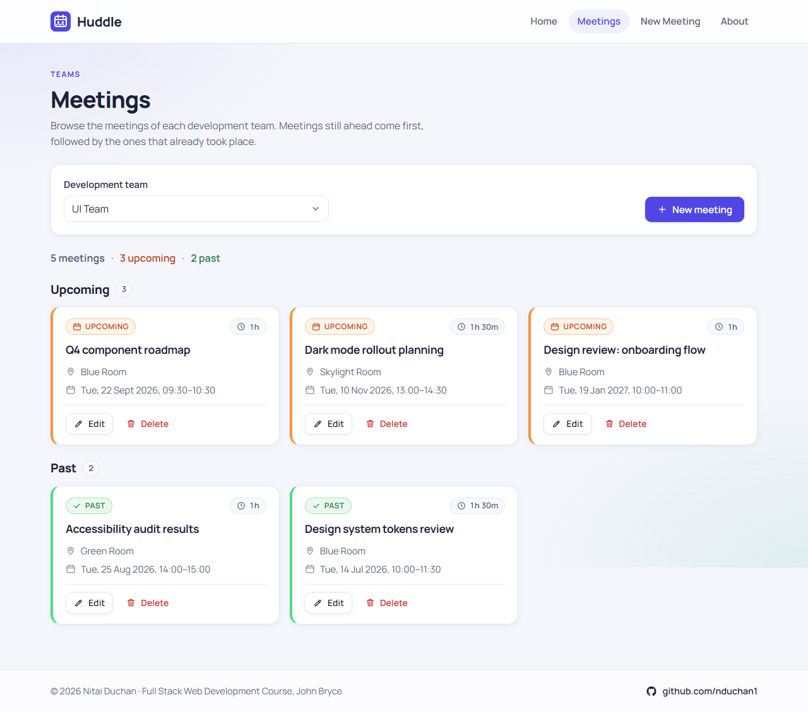

# Huddle

Meetings manager for the development teams of a high-tech company. Pick a team, see its upcoming and past meetings with their rooms and durations, and add, update or delete meetings.

**Live site:** https://nduchan1.github.io/huddle-meetings/

**Live API:** https://huddle-api-mu.vercel.app/api/health

**Repository:** https://github.com/nduchan1/huddle-meetings



## What it does

- **Home** – what the system is for, with a short introduction and an illustration.
- **Meetings** – a Select box with all development teams. Choosing a team shows only that team's meetings as cards, split into *Upcoming* (orange, start time still ahead) and *Past* (green, start time already passed). Every card shows the room, the date and time, the duration (for example "1h 30m") and Edit / Delete actions. Deleting asks for confirmation first.
- **New meeting** – a form with team, start, end, room and description. All fields are required, the start cannot be in the past and the end must be after the start. Errors appear inline under the fields.
- **Edit meeting** – the same form pre-filled with the meeting. Meetings that already took place can be edited; the end must still be after the start.
- **About** – describes the system and its author.

## Project structure

```
Database/   PostgreSQL schema, sample data and a pg_dump export of the live database
Backend/    Node.js + TypeScript + Express REST API (with tests and a Postman collection)
Frontend/   React + TypeScript single-page application (Vite)
```

Each folder has its own README with the details.

## Tech

| Layer | Stack |
| --- | --- |
| Database | PostgreSQL 18 on [Neon](https://neon.tech) |
| Backend | Node.js, TypeScript, Express 5, node-postgres, zod |
| Frontend | React 19, TypeScript, React Router, Vite, hand-written CSS |
| Hosting | Frontend on GitHub Pages, API on Vercel (Frankfurt), database on Neon (Frankfurt) |

## Running locally

Requirements: Node.js 20 or newer. The database is hosted on Neon, so nothing has to be installed for it; the connection string (a role limited to reading and writing the two application tables) is already in `Backend/.env`.

Backend (terminal 1):

```bash
cd Backend
npm install
npm run dev
```

The API listens on http://localhost:3001 (check http://localhost:3001/api/health).

Frontend (terminal 2):

```bash
cd Frontend
npm install
npm run dev
```

Open http://localhost:5173. The frontend reads the API address from `Frontend/.env` (`VITE_API_URL`).

To run against your own PostgreSQL instead, put its connection string in `Backend/.env` and load the schema and sample data with `npm run db:init` (from `Backend/`), or run the files in `Database/` yourself.

## API

Base URL: `http://localhost:3001` locally, `https://huddle-api-mu.vercel.app` in production. All bodies are JSON; times are ISO 8601 in UTC.

| Method | Route | Purpose |
| --- | --- | --- |
| GET | `/api/teams` | All development teams |
| GET | `/api/teams/:teamId/meetings` | All meetings of one team |
| GET | `/api/meetings/:id` | One meeting |
| POST | `/api/meetings` | Add a meeting |
| PUT | `/api/meetings/:id` | Update a meeting |
| DELETE | `/api/meetings/:id` | Delete a meeting |
| GET | `/api/health` | Service and database status |

Validation errors come back as `400 { "error": "Validation failed", "fields": { "startTime": "Start time cannot be in the past" } }`; unknown ids as `404 { "error": "Meeting not found" }`.

## Testing the API with Postman

`Backend/postman/Huddle-API.postman_collection.json` covers every route, including the validation errors, and chains the created meeting's id through the requests. Import it into Postman and use **Run collection**. Out of the box it targets the live API; to test a local server also import `Backend/postman/Huddle-Local.postman_environment.json` and select that environment.

From the command line:

```bash
npx newman run Backend/postman/Huddle-API.postman_collection.json -e Backend/postman/Huddle-Local.postman_environment.json
```

## Author

Nitai Duchan · [github.com/nduchan1](https://github.com/nduchan1)
